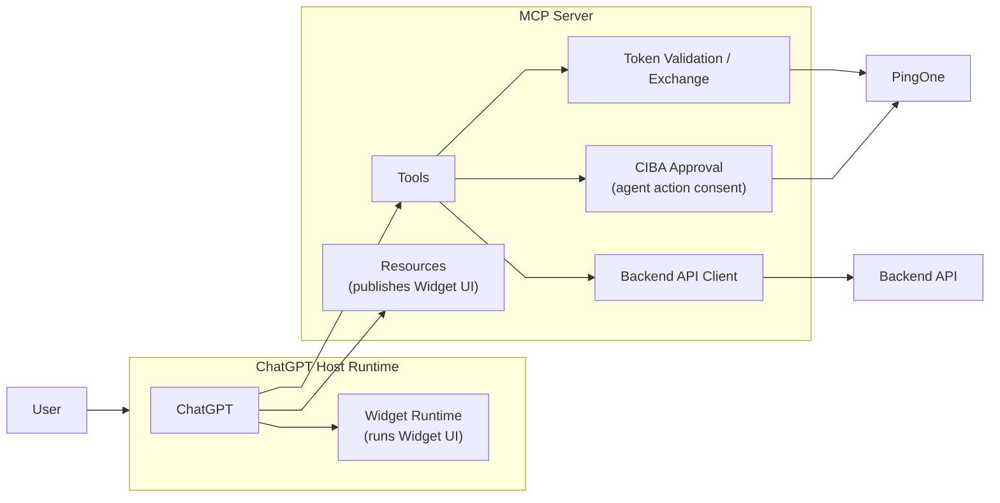
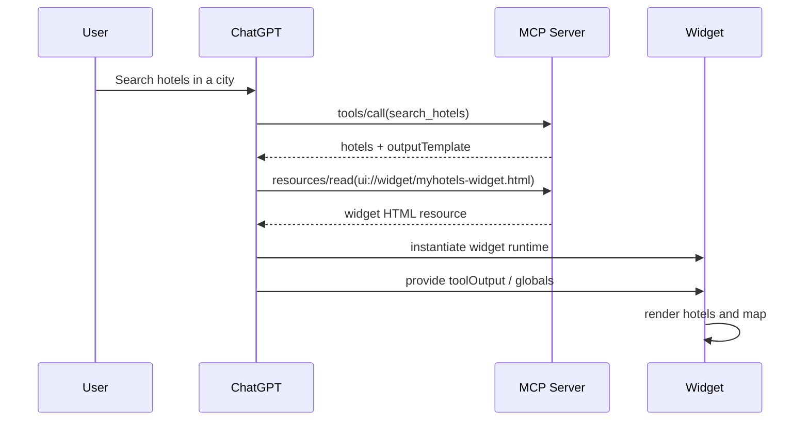
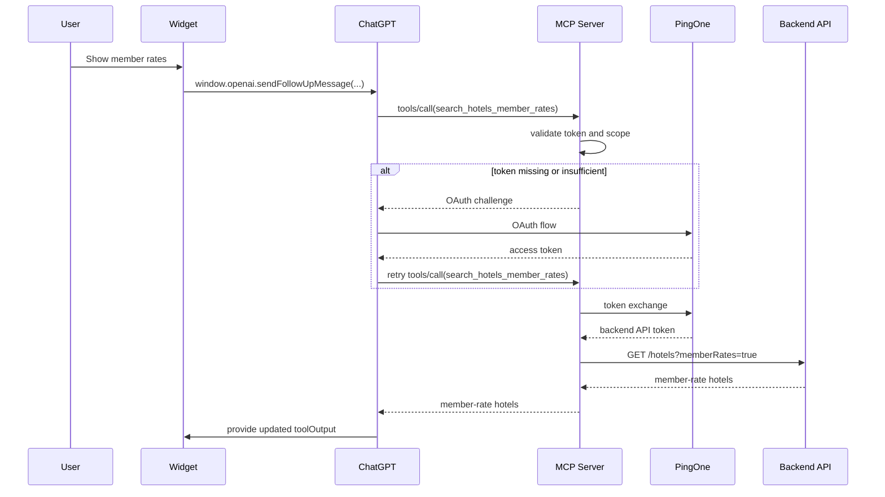
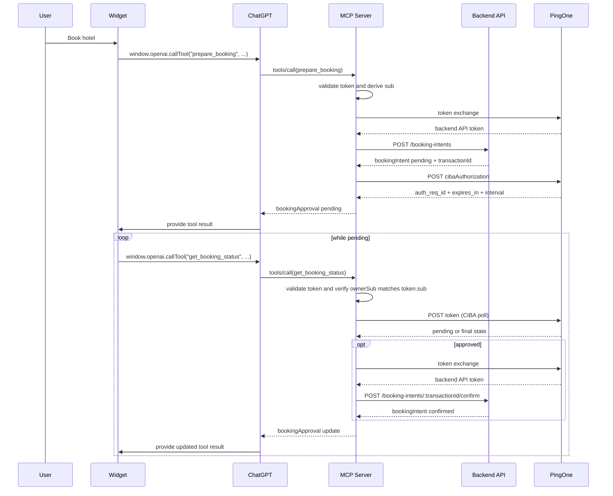

# MyHotels ChatGPT App

`MyHotels` is a ChatGPT app, built with the OpenAI Apps SDK, that allows:

- hotel search
- member-rate hotel search
- hotel booking with end-user approval

The project shows how ChatGPT, MCP, a backend hotel API, PingOne, and a widget UI can work together when some capabilities are public and others require PingOne-backed authentication and end-user authorization.

In a ChatGPT app, ChatGPT is the host runtime. It connects to the MCP server to discover tools, resources, and authentication requirements, then uses those definitions to decide what it can call and what UI it can render. When a tool response includes an `openai/outputTemplate` reference, ChatGPT reads the referenced MCP resource, mounts the widget in its sandboxed runtime, and exposes the `window.openai` bridge so the widget can call tools back through ChatGPT.

## Components

This project includes:

### MCP Server

The MCP server is the ChatGPT-facing integration layer. It:

- exposes MCP tools (`search_hotels`, `search_hotels_member_rates`, `prepare_booking`, `get_booking_status`)
- serves the widget resource that ChatGPT later mounts in its own widget runtime
- validates bearer tokens locally using PingOne-issued JWTs and JWKS
- performs OAuth token exchange before protected backend API calls
- starts and polls CIBA approval for agent-initiated booking actions
- calls the backend hotel REST API

The widget is a single-file HTML app rendered in ChatGPT. It:

- displays hotels on a map
- renders hotel cards and booking panels
- calls MCP tools through `window.openai`
- polls booking status while approval is pending

### Backend API Server

The backend API server owns the demo hotel business surface. It:

- exposes REST JSON endpoints for hotel search and booking intents
- stores the hotel catalog
- returns booking quotes
- creates pending booking transactions
- confirms approved booking transactions
- holds booking transaction state in memory for the demo

For the demo it provides mock data with no persistent storage.

## MCP Resources

The app currently exposes one primary resource:

- `ui://widget/myhotels-widget.html`

In MCP, a resource is server-provided content addressed by a URI and fetched through the MCP protocol, typically with `resources/read`.

In this app, `ui://widget/myhotels-widget.html` is not a public web URL. It is a logical MCP resource identifier. When a tool response includes `openai/outputTemplate: "ui://widget/myhotels-widget.html"`, ChatGPT asks the MCP server for that resource, receives the HTML, and then mounts that HTML inside ChatGPT's widget runtime.

## MCP Tools

At connection time, ChatGPT learns about the app surface by calling MCP discovery methods such as:

- `initialize`
- `tools/list`
- optionally `resources/list`

From those responses, ChatGPT learns:

- tool names and input schemas
- security requirements for each tool
- widget template references such as `openai/outputTemplate`
- what resources the MCP server can provide

### `search_hotels`

Public tool.

Purpose:
- search the hotel dataset by city or country

Returns:
- hotel list
- standard pricing
- widget template reference

### `search_hotels_member_rates`

Protected tool.

Purpose:
- return hotel results with member pricing

Security model:
- requires a valid bearer token
- MCP validates the JWT locally
- MCP requires the `my-hotels:mcp:member_rates` scope
- MCP exchanges the ChatGPT-facing token for a backend API token before calling the backend API

### `prepare_booking`

Protected tool.

Purpose:
- create a pending booking transaction
- delegate booking-intent creation to the backend API

Security model:
- requires a valid bearer token
- MCP validates the JWT locally
- MCP requires the `my-hotels:mcp:book` scope
- MCP derives the booking owner from token `sub`
- MCP exchanges the ChatGPT-facing token for a backend API token
- MCP creates a pending booking intent in the backend API
- MCP starts the CIBA approval flow using the backend transaction ID

### `get_booking_status`

Protected tool.

Purpose:
- return the current status of a pending booking approval (polled by the ChatGPT runtime)

Security model:
- requires a valid bearer token
- MCP requires the `my-hotels:mcp:book` scope
- booking status lookup requires both the exact `transactionId` and a bearer token whose `sub` matches the booking owner
- MCP polls PingOne CIBA until the transaction becomes `approved`, `denied`, or `expired`
- after approval, MCP exchanges the ChatGPT-facing token for a backend API token and confirms the backend booking intent

## Backend APIs

The backend API is a separate REST JSON service behind the MCP layer. It is not called directly by ChatGPT or the widget. The MCP uses it after local token validation and, for protected routes, after token exchange.

The main backend endpoints are:

- `GET /hotels`
  - returns public hotel results
  - when called with `memberRates=true`, requires a backend API token with `my-hotels:api:member_rates`
- `POST /booking-intents`
  - creates a new booking intent for a specific hotel and stay request
  - requires a backend API token with `my-hotels:api:book`
- `GET /booking-intents/:transactionId`
  - returns the current booking-intent status
  - requires a backend API token with `my-hotels:api:book`
- `POST /booking-intents/:transactionId/confirm`
  - confirms an existing booking intent after MCP-owned user approval
  - requires a backend API token with `my-hotels:api:book`

The backend API validates its own bearer tokens locally using JWT signature verification and JWKS. Those tokens are obtained by the MCP through OAuth token exchange.

## Security Model

The current implementation uses a mixed model:

- public search does not require OAuth
- member-rate search and booking require PingOne-issued access tokens for the MCP-facing audience and operation-specific scopes
- the MCP validates the incoming bearer token locally using JWT signature verification and JWKS
- for protected backend calls, the MCP performs OAuth token exchange to obtain a backend API access token with the backend audience and the matching API scope
- the backend API validates that exchanged token locally using JWT signature verification and JWKS
- the MCP owns CIBA approval state for agent-initiated booking actions
- the backend API owns booking transaction state and has no CIBA dependency
- booking status lookup requires both:
  - the exact `transactionId`
  - a bearer token whose `sub` matches the MCP approval owner
- after CIBA approval, the MCP confirms the backend booking intent through the backend API
- the CIBA `auth_req_id` is kept in MCP memory and is not trusted as a client-supplied lookup key

## Runtime Behavior

Before the first user-driven tool call, ChatGPT initializes the MCP connection and discovers the app metadata:

1. ChatGPT calls `initialize`
2. ChatGPT calls `tools/list`
3. ChatGPT learns tool metadata, including:
   - schemas
   - auth requirements
   - `openai/outputTemplate`
4. When needed, ChatGPT reads the widget resource from the MCP server

### Public search

1. ChatGPT calls `search_hotels`
2. MCP returns hotel data plus the widget template reference
3. ChatGPT reads `ui://widget/myhotels-widget.html` from the MCP server
4. ChatGPT mounts the widget in its own runtime
5. ChatGPT provides the tool result to the widget as host state
6. The widget renders map markers and hotel detail panels

### Member rates

1. User asks to see member rates
2. ChatGPT calls `search_hotels_member_rates`
3. MCP checks bearer token and required scope
4. If auth is missing or insufficient, MCP returns an OAuth challenge
5. ChatGPT completes OAuth and retries
6. MCP exchanges the ChatGPT-facing token for a backend API token
7. MCP calls the backend API and returns protected pricing

### Booking

1. User selects a hotel and clicks `Book`
2. Widget calls `prepare_booking`
3. MCP validates the incoming token
4. MCP exchanges it for a backend API token
5. MCP creates a pending booking intent in the backend API
6. Backend returns the booking transaction ID and quote
7. MCP starts CIBA approval with that transaction ID in the approval context
8. Widget polls `get_booking_status`
9. MCP polls PingOne for approval status
10. After approval, MCP confirms the backend booking intent and returns the approved status

## Sequence Diagrams

### Public Search

### Protected Member Rates

### Booking with CIBA

## Endpoints

The app exposes the following MCP-facing endpoints:

- `/mcp`
- `/.well-known/oauth-protected-resource`
- `/widget/myhotels-widget`

## Configuration Info

- [CONFIGURATION.md](./CONFIGURATION.md): PingOne setup, environment variables, build/run steps, connector setup

## License

MIT
