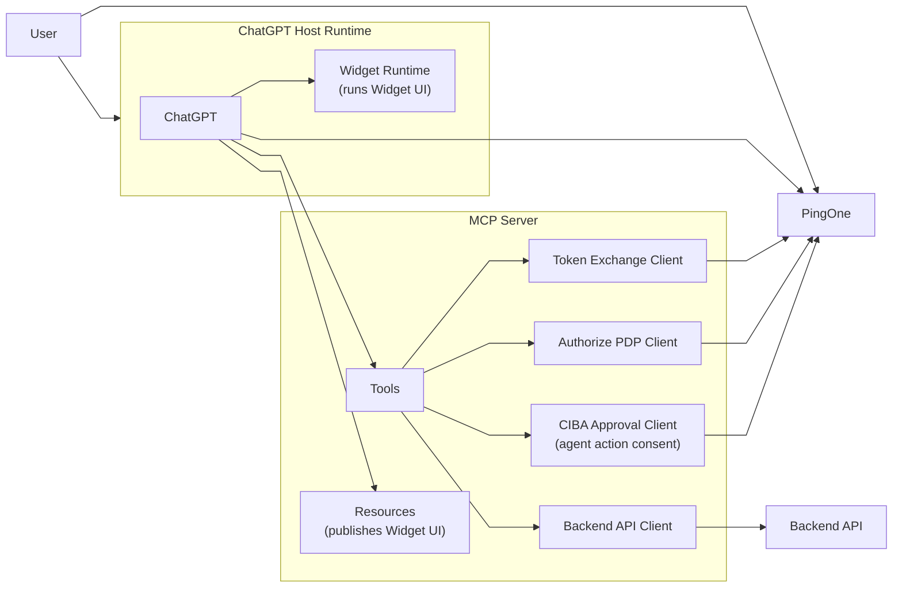
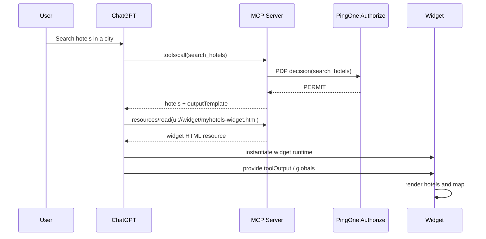
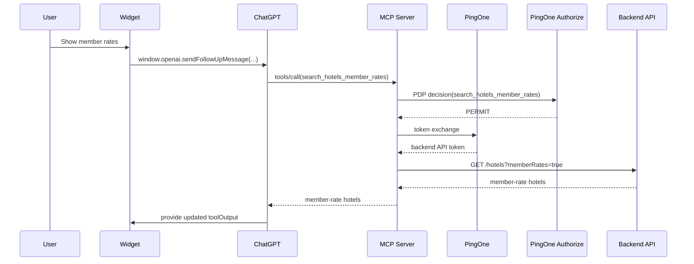
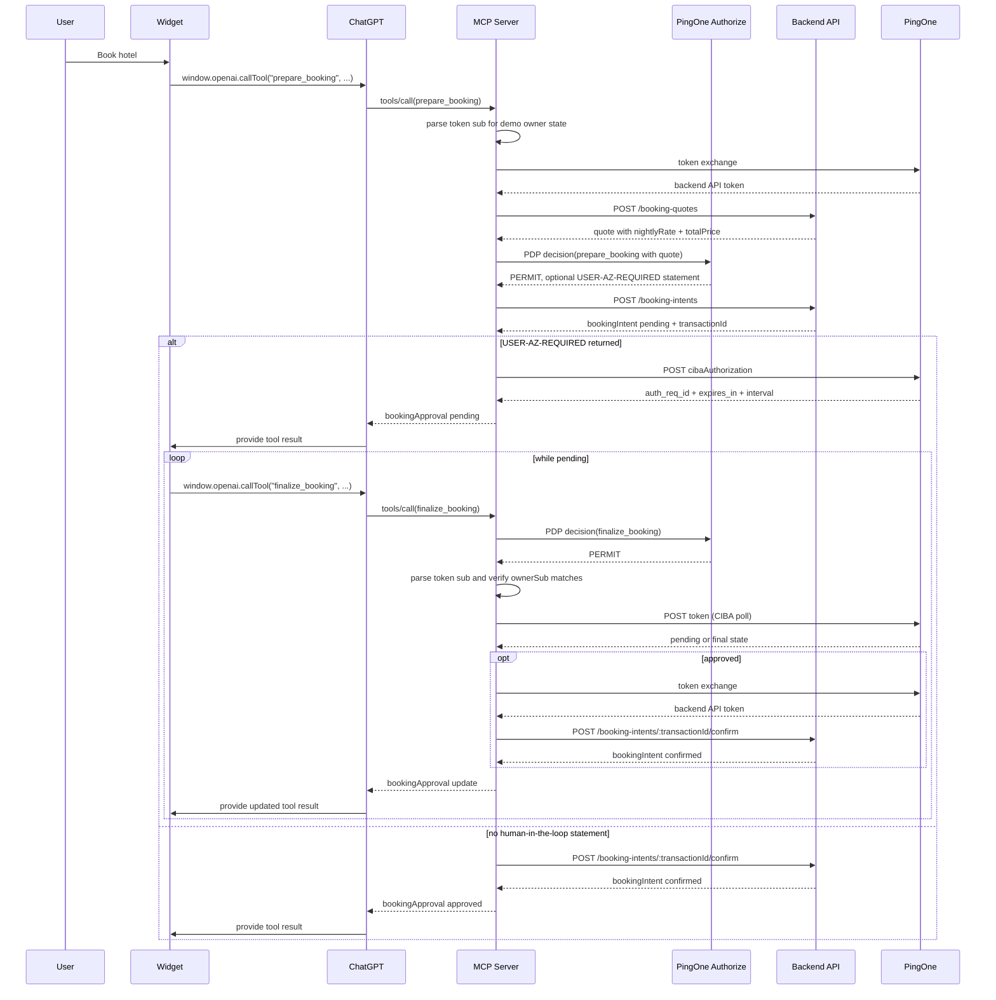

# MyHotels ChatGPT App

`MyHotels` is a **demo** ChatGPT app, built with the OpenAI Apps SDK, that allows:

- hotel search
- member-rate hotel search
- hotel booking with end-user approval

The project shows how ChatGPT, a ChatGPT App, an MCP server, a backend hotel API, and PingOne can work together to authenticate and authorize users when some capabilities are public and others are protected.

The demo uses PingOne for four main identity and authorization capabilities:

- agent registration: the ChatGPT-facing AI Agent is registered in PingOne and attached to the MCP protected resource
- user authentication: ChatGPT signs users in through PingOne before calling protected MCP tools
- token exchange: the MCP server exchanges the ChatGPT-facing token for a backend API token with the backend audience and scopes
- agent authorization: PingOne Authorize evaluates MCP tool calls and can require end-user approval for booking actions

**Demo Disclaimers**

- This is a demo application. It uses sample hotel, booking, user, and payment data, and runtime state is not persisted.
- The goal is to demonstrate an integration pattern between ChatGPT, MCP, a widget UI, a backend API, and PingOne.
- For simplicity, the demo uses static client credentials, it does not implement workload attestation and simplifies the overall flows.

## Logical Architecture

The following diagram shows the high level logical architecture, described below.



- User: interacts with ChatGPT and the mounted widget to search hotels, request member rates, and approve or finalize booking actions. The user also signs in and completes approval prompts through PingOne.
- ChatGPT Host Runtime: discovers MCP tools, resources, and authentication requirements; calls MCP tools on behalf of the user; reads widget resources referenced by `openai/outputTemplate`; mounts the widget in its sandboxed runtime; and uses PingOne during the OAuth flow for protected MCP tools.
- Widget Runtime: runs the MyHotels widget UI inside ChatGPT and uses the `window.openai` bridge to call tools back through ChatGPT.
- MCP Server: exposes the hotel tools, publishes the widget HTML as an MCP resource, calls PingOne Authorize for policy decisions, exchanges tokens for backend API access, starts CIBA approval when policy requires end-user consent, and calls the backend hotel API.
- Backend API: owns the demo hotel business surface, including the hotel catalog, member-rate access, booking quotes, booking intents, and mocked booking confirmation.
- PingOne: provides the identity and authorization services used by the demo, including agent registration, user authentication, token exchange, policy decisions, and CIBA-based end-user approval.

## Security Model

The current implementation uses a mixed model, where:

- public search does not require OAuth tokens
- member-rate search and booking require OAuth tokens whose requirements are advertised to ChatGPT through MCP tool metadata
- tool access is enforced by the MCP server via OAuth scopes and fine grained authorization decisions, all modeled in PingOne Authorize
- every MCP tool call is sent to PingOne Authorize which can return a `PERMIT` or `DENY` decision as well as obligations to request user authorization for booking actions
- when a Human in the Loop obligation is sent to the MCP server, the MCP initiates a CIBA flow to obtain end-user authorization
- for protected backend calls, the MCP performs OAuth token exchange with PingOne to obtain a backend API access token 
- the backend API validates that exchanged token locally and authorizes access to the APIs

At a high level, PingOne Authorize implements these MCP policies:

- Public Tools: permits `search_hotels` so unauthenticated users can search the public hotel catalog.
- Allow ChatGPT Member Rates Access: applies to `search_hotels_member_rates` and permits only when the caller is a ChatGPT user, the token was issued to ChatGPT, the token is for the Hotel MCP, and the token has the member-rates permission (scope).
- Allow ChatGPT Booking Initialization Access: applies to `prepare_booking` and requires the ChatGPT user, ChatGPT-issued token, Hotel MCP audience, and booking initialization permission (scope). It also evaluates the booking amount: payments below 200 EUR are allowed, payments above 200 EUR require a Human in the Loop obligation, and payments above 1000 EUR are denied.
- Allow ChatGPT Booking Finalize Access: applies to `finalize_booking` and permits only when the caller is a ChatGPT user, the token was issued to ChatGPT, the token is for the Hotel MCP, and the token has the finalize payment permission.
- Default Deny: denies any MCP request that does not match one of the explicit allow policies.

The MCP server invokes the PingOne Authorize PDP with a flattened payload that identifies the service, tool resource, selected tool parameters, and inbound ChatGPT bearer token. For example, a `prepare_booking` decision includes:

```json
{
  "parameters": {
    "MyHotels.service": "myhotels-hotelmcp",
    "MyHotels.resource": "prepare_booking",
    "MyHotels.parameters.totalPrice": 1734,
    "MyHotels.parameters.currency": "EUR",
    "MyHotels.bearerToken": "<redacted-chatgpt-facing-access-token>"
  }
}
```

## Components

This project includes:

### MCP Server

The MCP server is the ChatGPT-facing integration layer. It:

- exposes MCP tools (`search_hotels`, `search_hotels_member_rates`, `prepare_booking`, `finalize_booking`)
- serves the widget resource that ChatGPT later mounts in its own widget runtime
- calls PingOne Authorize for every MCP tool call and continues only on `PERMIT`
- passes the inbound ChatGPT bearer token to Authorize for policy and token evaluation
- parses permitted JWT claims for demo state such as display name and booking owner, without locally validating the JWT
- performs OAuth token exchange before protected backend API calls
- starts and polls CIBA approval when PingOne Authorize returns a human-in-the-loop obligation
- calls the backend hotel REST API

The widget is a single-file HTML app rendered in ChatGPT. It:

- displays hotels on a map
- renders hotel cards and booking panels
- calls MCP tools through `window.openai`
- polls booking finalization while approval is pending

### Backend API Server

The backend API server owns the demo hotel business surface. It:

- exposes REST JSON endpoints for hotel search and booking intents
- stores the hotel catalog
- returns booking quotes
- creates pending booking transactions
- confirms approved booking transactions
- holds booking transaction state in memory for the demo

For the demo it provides mock data with no persistent storage.

## MCP Resources

The app currently exposes one primary resource:

- `ui://widget/myhotels-widget.html`

In MCP, a resource is server-provided content addressed by a URI and fetched through the MCP protocol, typically with `resources/read`.

In this app, `ui://widget/myhotels-widget.html` is not a public web URL. It is a logical MCP resource identifier. When a tool response includes `openai/outputTemplate: "ui://widget/myhotels-widget.html"`, ChatGPT asks the MCP server for that resource, receives the HTML, and then mounts that HTML inside ChatGPT's widget runtime.

## MCP Tools

At connection time, ChatGPT learns about the app surface by calling MCP discovery methods such as:

- `initialize`
- `tools/list`
- optionally `resources/list`

From those responses, ChatGPT learns:

- tool names and input schemas
- security requirements for each tool
- widget template references such as `openai/outputTemplate`
- what resources the MCP server can provide

### `search_hotels`

Public tool.

Purpose:
- search the hotel dataset by city or country

Returns:
- hotel list
- standard pricing
- widget template reference

Security model:
- does not require OAuth
- MCP calls PingOne Authorize before returning public hotel results
- the Authorize decision must be `PERMIT`

### `search_hotels_member_rates`

Protected tool.

Purpose:
- return hotel results with member pricing

Security model:
- MCP calls PingOne Authorize before returning member-rate hotel results
- the Authorize decision must be `PERMIT`
- the inbound bearer token is forwarded to Authorize as policy input
- after `PERMIT`, MCP exchanges the ChatGPT-facing token for a backend API token before calling the backend API

### `prepare_booking`

Protected tool.

Purpose:
- create a pending booking transaction
- delegate booking-intent creation to the backend API

Security model:
- MCP calls PingOne Authorize before creating the backend booking intent
- the Authorize decision must be `PERMIT`
- the inbound bearer token is forwarded to Authorize as policy input
- after `PERMIT`, MCP parses token `sub` for the demo booking owner
- MCP exchanges the ChatGPT-facing token for a backend API token
- MCP creates a pending booking intent in the backend API
- if Authorize returns statement `USER-AZ-REQUIRED`, MCP starts the CIBA approval flow using the backend transaction ID
- if that statement is absent, MCP confirms the backend booking immediately

Payment assumption:
- the demo assumes the signed-in user already has a payment method on record with MyHotels and MyHotel mocks the payment process
- the personal agent does not directly complete or submit the payment

### `finalize_booking`

Protected tool.

Purpose:
- attempt to finalize a pending booking approval
- return `pending` while user approval is still incomplete
- confirm the backend booking once approval is complete

Security model:
- booking finalization requires both the exact `transactionId` and a bearer token whose `sub` matches the booking owner
- MCP calls PingOne Authorize before attempting finalization
- the Authorize decision must be `PERMIT`
- the inbound bearer token is forwarded to Authorize as policy input
- after `PERMIT`, MCP parses token `sub` to match the demo booking owner
- MCP polls PingOne CIBA for transactions that required human approval until the transaction becomes `approved`, `denied`, or `expired`
- after approval, MCP exchanges the ChatGPT-facing token for a backend API token and confirms the backend booking intent

## Backend APIs

The backend API is a separate REST JSON service behind the MCP layer. It is not called directly by ChatGPT or the widget. The MCP uses it after the Authorize PDP returns `PERMIT` and, for protected routes, after token exchange.

The main backend endpoints are:

- `GET /hotels`
  - returns public hotel results
  - when called with `memberRates=true`, requires a backend API token with `my-hotels:api:member_rates`
- `POST /booking-quotes`
  - returns the authoritative quote for a specific hotel and stay request
  - requires a backend API token with `my-hotels:api:book`
  - used by the MCP before the Authorize decision so policy can evaluate `nightlyRate`, `totalPrice`, and `currency`
- `POST /booking-intents`
  - creates a new booking intent for a specific hotel and stay request
  - requires a backend API token with `my-hotels:api:book`
- `GET /booking-intents/:transactionId`
  - returns the current booking-intent status
  - requires a backend API token with `my-hotels:api:book`
- `POST /booking-intents/:transactionId/confirm`
  - confirms an existing booking intent after MCP-owned user approval
  - requires a backend API token with `my-hotels:api:book`

The backend API validates its own bearer tokens locally using JWT signature verification and JWKS. Those tokens are obtained by the MCP through OAuth token exchange.

## Runtime Behavior

Before the first user-driven tool call, ChatGPT initializes the MCP connection and discovers the app metadata:

1. ChatGPT calls `initialize`
2. ChatGPT calls `tools/list`
3. ChatGPT learns tool metadata, including:
   - schemas
   - auth requirements
   - `openai/outputTemplate`
4. When needed, ChatGPT reads the widget resource from the MCP server

### Public search

1. ChatGPT calls `search_hotels`
2. MCP asks PingOne Authorize for a policy decision
3. If Authorize returns `PERMIT`, MCP returns hotel data plus the widget template reference
4. ChatGPT reads `ui://widget/myhotels-widget.html` from the MCP server
5. ChatGPT mounts the widget in its own runtime
6. ChatGPT provides the tool result to the widget as host state
7. The widget renders map markers and hotel detail panels

### Member rates

1. User asks to see member rates
2. ChatGPT calls `search_hotels_member_rates`
3. MCP asks PingOne Authorize for a policy decision with the inbound bearer token
4. If Authorize returns `PERMIT`, MCP exchanges the ChatGPT-facing token for a backend API token
5. MCP calls the backend API and returns protected pricing

### Booking

1. User selects a hotel and clicks `Book`
2. Widget calls `prepare_booking`
3. MCP parses `sub` for the demo booking owner
4. MCP exchanges the token for a backend API token
5. MCP asks the backend API for an authoritative booking quote
6. MCP asks PingOne Authorize for a policy decision with the inbound bearer token and quote amount
7. If Authorize returns `PERMIT`, MCP creates a pending booking intent in the backend API
8. If Authorize returned `USER-AZ-REQUIRED`, MCP starts CIBA approval with that transaction ID in the approval context
9. If no human-in-the-loop statement was returned, MCP confirms the backend booking immediately
10. For human-in-the-loop bookings, the widget polls `finalize_booking`
11. MCP asks PingOne Authorize for each finalization attempt
12. MCP parses `sub` and checks that it matches the stored booking owner
13. MCP polls PingOne for approval status
14. After approval, MCP confirms the backend booking intent and returns the approved status

## Sequence Diagrams

### Public Search



### Protected Member Rates



### Booking with CIBA



## Endpoints

The app exposes the following MCP-facing endpoints:

- `/mcp`
- `/.well-known/oauth-protected-resource`
- `/widget/myhotels-widget`

## Configuration Info

- [CONFIGURATION.md](./CONFIGURATION.md): PingOne setup, environment variables, build/run steps, connector setup

## License

MIT
