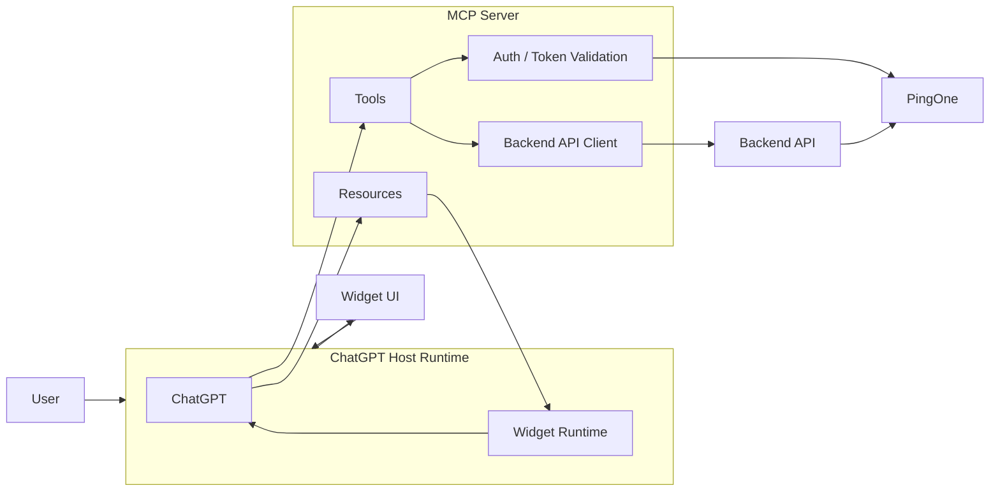
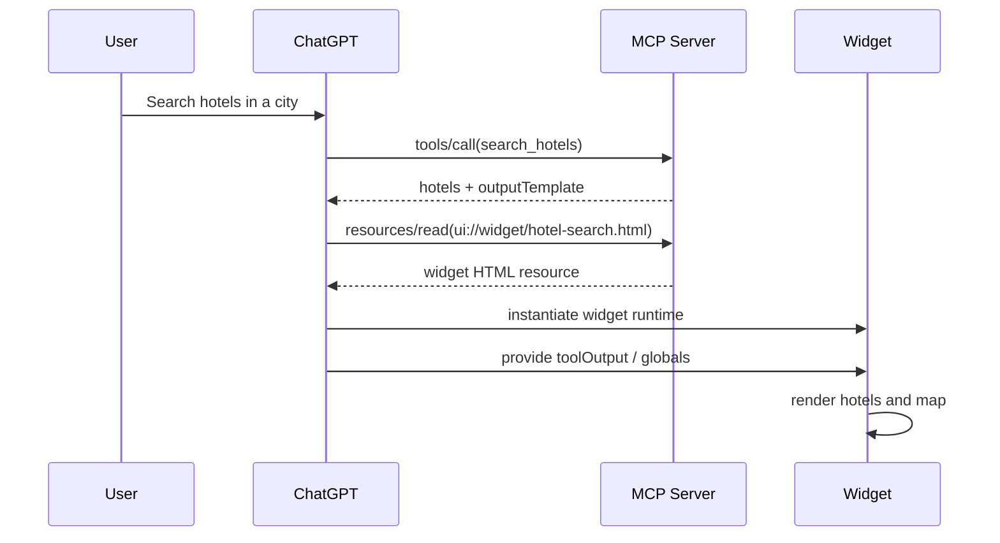
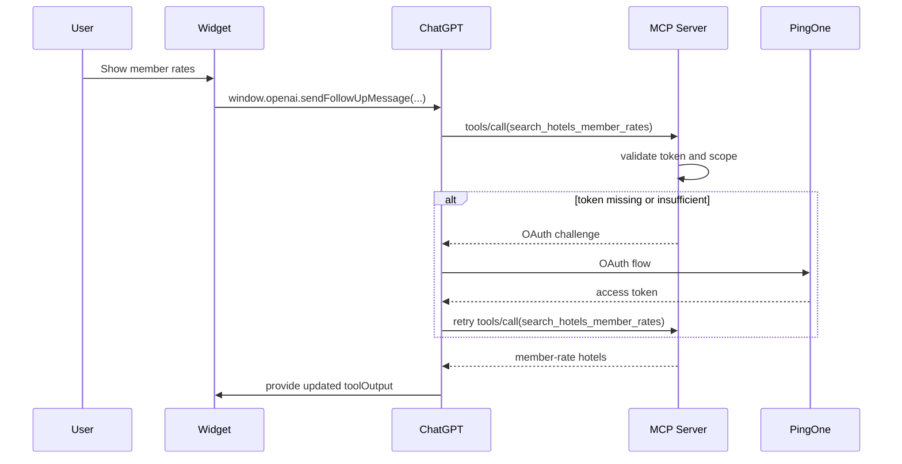
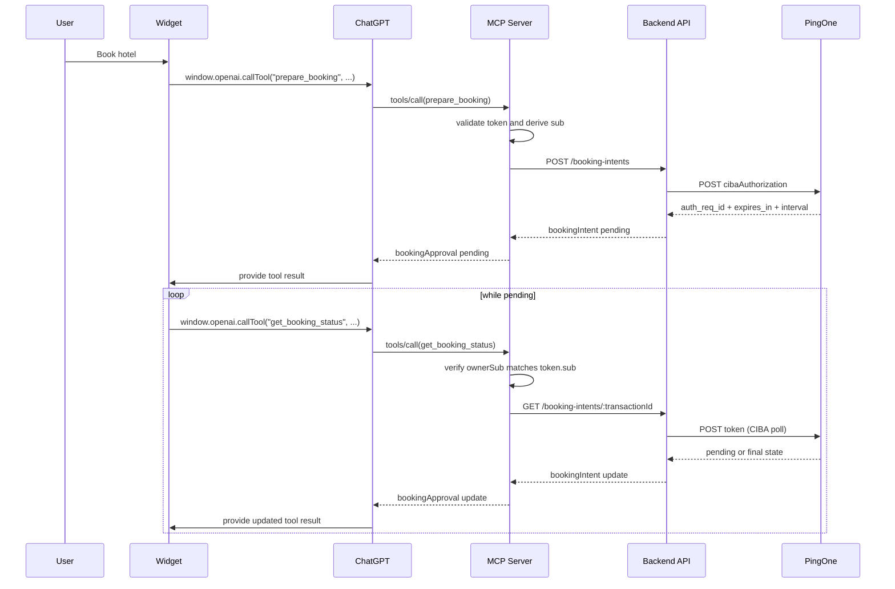

# MyHotels ChatGPT App

`MyHotels` is a ChatGPT app, built with the OpenAI Apps SDK, that allows:

- hotels search
- members hotel search
- hotel booking, with end user approval

The project shows how ChatGPT, MCP, a backend hotel API, PingOne, and a widget UI can work together when some capabilities are public and others require PingOne-backed authentication and end-user authorization.

In a ChatGPT app, ChatGPT is the host runtime. It connects to the MCP server to discover tools, resources, and authentication requirements, then uses those definitions to decide what it can call and what UI it can render. When a tool response includes an `openai/outputTemplate` reference, ChatGPT reads the referenced MCP resource, mounts the widget in its sandboxed runtime, and exposes the `window.openai` bridge so the widget can call tools back through ChatGPT.

## Components

This project includes: 

### MCP Server

The MCP server is the ChatGPT-facing integration layer. It:

- exposes MCP tools
- serves the widget resource that ChatGPT later mounts in its own widget runtime
- validates bearer tokens locally using PingOne-issued JWTs and JWKS
- calls the backend hotel REST API

### Backend API Server

The backend API server owns the hotel business surface. It:

- exposes REST JSON endpoints for hotel search and booking
- stores the hotel catalog
- returns booking quotes
- creates confirmed bookings after the MCP completes approval

### Widget UI

The widget is a single-file HTML app rendered in ChatGPT. It:

- displays hotels on a map
- renders hotel cards
- calls MCP tools through `window.openai`
- polls booking status while approval is pending

## MCP Resources

The app currently exposes one primary resource:

- `ui://widget/hotel-search.html`

In MCP, a resource is server-provided content addressed by a URI and fetched through the MCP protocol, typically with `resources/read`.

In this app, `ui://widget/hotel-search.html` is not a public web URL. It is a logical MCP resource identifier. When a tool response includes `openai/outputTemplate: "ui://widget/hotel-search.html"`, ChatGPT asks the MCP server for that resource, receives the HTML, and then mounts that HTML inside ChatGPT's widget runtime.

## MCP Tools

At connection time, ChatGPT learns about the app surface by calling MCP discovery methods such as:

- `initialize`
- `tools/list`
- optionally `resources/list`

From those responses, ChatGPT learns:

- tool names and input schemas
- security requirements for each tool
- widget template references such as `openai/outputTemplate`
- what resources the MCP server can provide

### `search_hotels`

Public tool.

Purpose:
- search the hotel dataset by city or country

Returns:
- hotel list
- standard pricing
- widget template reference

### `search_hotels_member_rates`

Protected tool.

Purpose:
- return hotel results with member pricing

Security model:
- requires a valid bearer token
- MCP validates the JWT locally
- MCP requires the `hotels:member_access` scope

### `prepare_booking`

Protected tool.

Purpose:
- create a pending booking transaction
- delegate booking-intent creation to the backend API

Security model:
- requires a valid bearer token
- MCP validates the JWT locally
- MCP derives the booking owner from token `sub`
- MCP forwards the request to the backend API
- backend creates the booking intent and starts CIBA

### `get_booking_status`

Protected tool.

Purpose:
- return the current status of a pending booking approval

Security model:
- requires a valid bearer token
- booking lookup is bound to `ownerSub === token.sub`
- MCP forwards the status request to the backend API
- backend polls PingOne until the transaction becomes `approved`, `denied`, or `expired`

## Security Model

The current implementation uses a mixed model:

- public search does not require OAuth
- protected search and booking require PingOne-backed access tokens
- token validation happens in the MCP server through local JWT verification
- booking intents and approval state live in the backend API
- booking state is user-bound through the token `sub`

## Runtime Behavior

Before the first user-driven tool call, ChatGPT initializes the MCP connection and discovers the app metadata:

1. ChatGPT calls `initialize`
2. ChatGPT calls `tools/list`
3. ChatGPT learns tool metadata, including:
   - schemas
   - auth requirements
   - `openai/outputTemplate`
4. When needed, ChatGPT reads the widget resource from the MCP server

### Public search

1. ChatGPT calls `search_hotels`
2. MCP returns hotel data plus the widget template reference
3. ChatGPT reads `ui://widget/hotel-search.html` from the MCP server
4. ChatGPT mounts the widget in its own runtime
5. ChatGPT provides the tool result to the widget as host state
6. The widget renders map markers and hotel detail panels

### Member rates

1. User asks to see member rates
2. ChatGPT calls `search_hotels_member_rates`
3. MCP checks bearer token and required scope
4. If auth is missing or insufficient, MCP returns an OAuth challenge
5. ChatGPT completes OAuth and retries
6. MCP calls the backend API and returns protected pricing

### Booking

1. User selects a hotel and clicks `Book`
2. Widget calls `prepare_booking`
3. MCP validates the token and forwards the request to the backend API
4. Backend creates the booking intent, starts CIBA, and stores the pending approval transaction
5. Widget polls `get_booking_status`
6. MCP forwards the poll request to the backend API
7. Backend polls PingOne and returns the updated booking-intent status

## Sequence Diagrams

### Public Search

### Protected Member Rates

### Booking with CIBA

## Endpoints

The app exposes the following endpoints:

- `/mcp`
- `/.well-known/oauth-protected-resource`
- `/widget/hotel-search`

## Configuration Info

- [CONFIGURATION.md](/Users/fcarbone/Documents/projects/ai/chatgpt-apps-mixed-auth/CONFIGURATION.md): PingOne setup, environment variables, build/run steps, connector setup

## License

MIT
